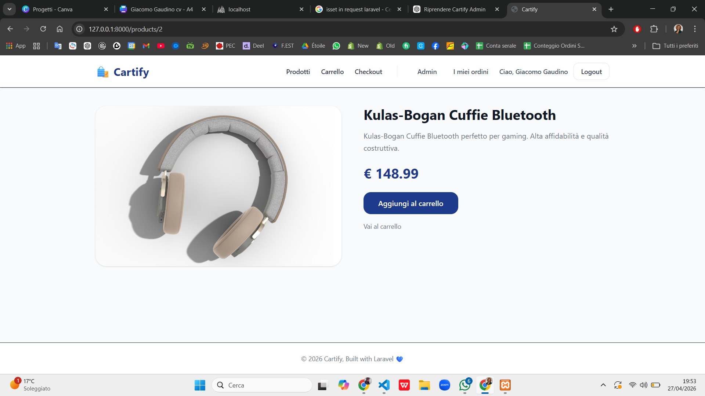
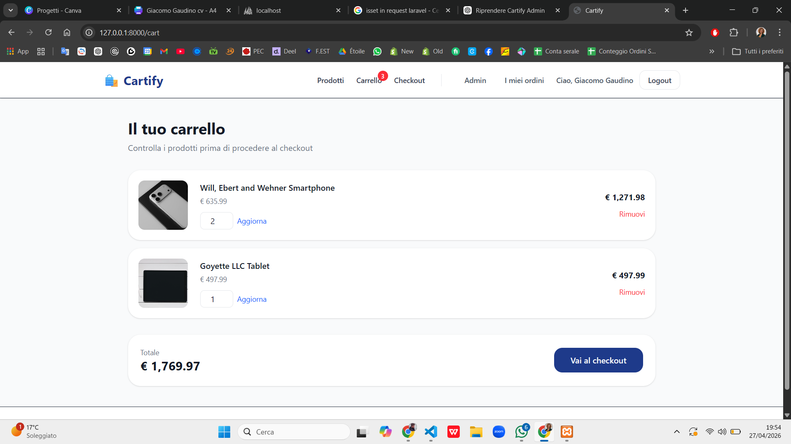
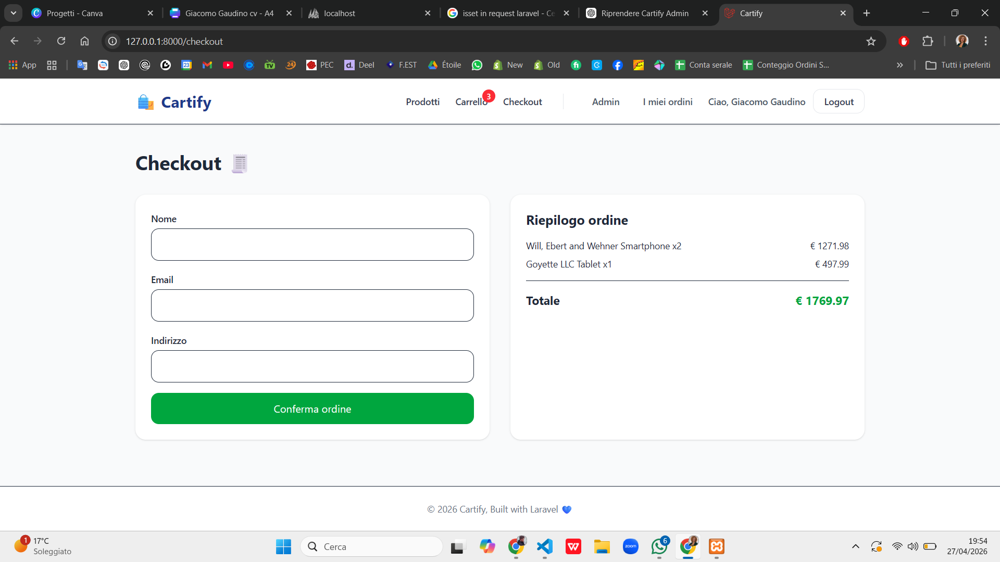
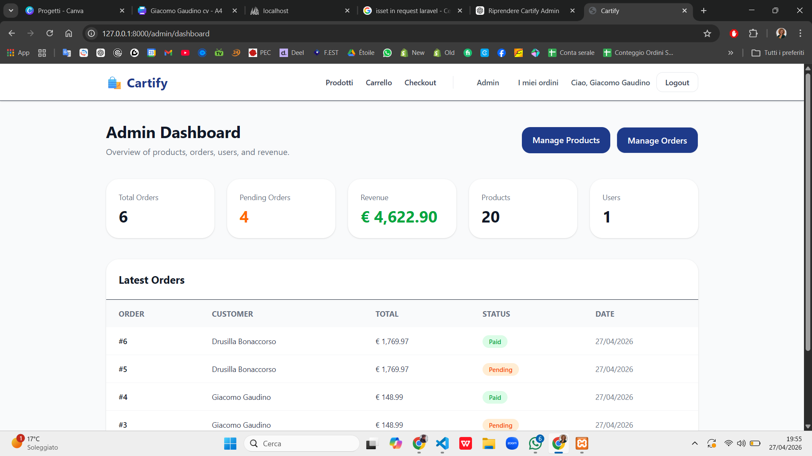
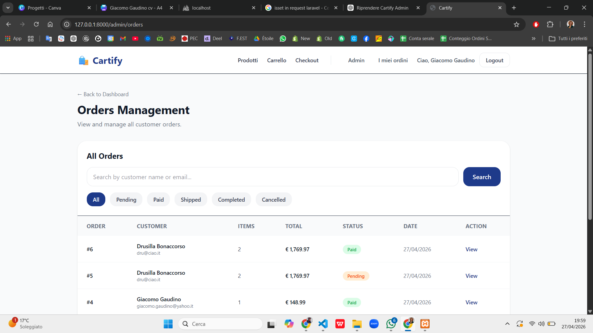

# Cartify

Cartify is a full stack e-commerce web application built with Laravel, designed to simulate a real-world online shopping experience.

---

## 🚀 Overview

Cartify provides a complete purchase flow, from product browsing to payment processing.

The project focuses on backend architecture, data consistency, and integration with external services like Stripe.

---

## ✨ Features

- Product catalog with detailed product pages  
- Session-based shopping cart  
- Dynamic cart management (add, update, remove items)  
- Checkout flow with form validation  
- Order creation with related order items  
- Stripe payment integration (test mode)  
- Order status management (pending → paid)  
- Admin dashboard for order monitoring  
- Order filtering (status, customer name, email)  
- Order success page with full summary  

---

## 🛠 Tech Stack

- **Backend:** Laravel (PHP)  
- **Frontend:** Blade, Tailwind CSS  
- **Database:** MySQL  
- **Payments:** Stripe API  

---

## 💳 Payment Integration

Payments are handled through Stripe in test mode.

Flow:
1. User submits checkout form  
2. Order is created with status `pending`  
3. User is redirected to Stripe Checkout  
4. On successful payment, order is updated to `paid`  

---

## 📸 Screenshots

## 📸 Screenshots

### Homepage


### Product Page


### Cart


### Checkout


### Payment Success


### Admin Dashboard


### Admin Orders
  

---

## ⚙️ Installation

```bash
git clone https://github.com/GiacomoGaudino/Cartify
cd Cartify
composer install
cp .env.example .env
php artisan key:generate

Configure your database in .env, then run:

php artisan migrate --seed
php artisan serve
🔐 Environment Variables
STRIPE_KEY=your_public_key
STRIPE_SECRET=your_secret_key
📌 Notes

This project uses client-side payment confirmation.
In production environments, Stripe webhooks should be implemented for secure payment validation.

📈 Future Improvements
Stripe webhook integration
Order history improvements
User authentication enhancements
UI/UX refinements
Product image management improvements


👨‍💻 Author

Giacomo Gaudino